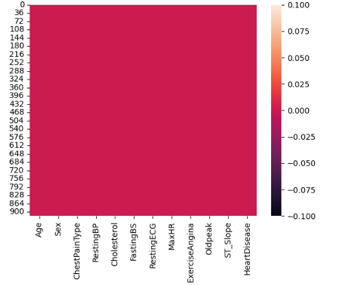
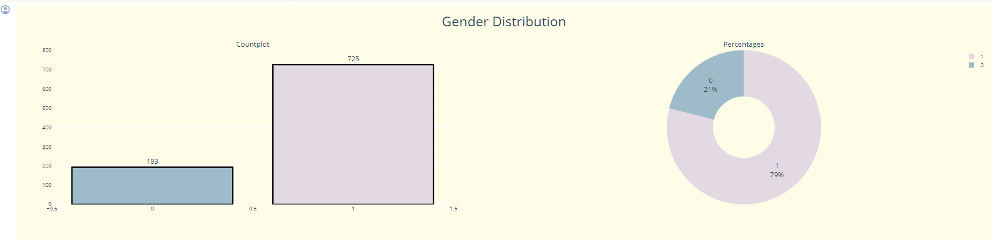

# Laporan Proyek Machine Learning
### Nama : Ari Supriatna
### Nim : 211351023 
### Kelas : Malam B

## Domain Proyek

Dijaman sekarang ini banyak masyarakat tidak memperhatikan kesehatan, dikarenakan asik bermain gadget dan memakan makanan yang cepat saji (instan) / bernilai gizi rendah, maka dari itu diperlukan adanya suatu sistem yang dapat memprediksi kesehatan jantung masyarakat dengan mudah dan akurat.

## Business Understanding

Untuk membantu dan memudahkan team medis dalam mendiagnosis penyakit jantung.

### Problem Statements

Untuk membantu tenaga medis dalam penanganan mendiagnosis penyakit jantung dengan menggunakan beberapa inputan inputan gejala yang dirasakan

### Goals
Tujuan dari proyek ini adalah : 
- Supaya pencegahan yang dapat dilakukan sebelum terjangkitnya penyakit jantung dengan hasil prediksi.
- Membantu tim medis dalam mendiagnosis penyakit jantung

Semua poin di atas harus diuraikan dengan jelas. Anda bebas menuliskan berapa pernyataan masalah dan juga goals yang diinginkan.

### Rubrik/Kriteria Tambahan

Dengan masyarakat mengetahui kesehatan jantungnya masyakarat akan lebih peduli terhadap pola hidupnya dan ketika diketahui kurang sehat maka diharapkan masyarakat untuk segera melakukan pemerikasaan ke dokter agar tidak tambah parah

### Solution statements
  
Masyarakat nantinya akan diberikan beberapa pertanyaan tentang gejala yang dirasakan saat ini, nantinya aplikasi akan menghitung presentase gejala yang memunuhi dia punya masalah penyakit jantung atau tidak. 

## Data Understanding

Dataset "Heart Failure Prediction" adalah data yang didapatkan dari platform kaggle. ini adalah hasil total data observasi 1190 kali dan di duplikasi sebanyak 272 kali observasi dan final datasetnya : 918 observations

[Heart Failure Prediction Dataset](https://www.kaggle.com/datasets/fedesoriano/heart-failure-prediction/data).

### Variabel-variabel pada Heart Disease Prediction adalah sebagai berikut:
<strong>1. Age</strong> : merupakan umur pasien dalam satuan tahun

<strong>2. Sex</strong> : merupakan jenis kelamin pasien meliputi [M: Male, F: Female]

<strong>3. ChestPainType </strong>: chest pain type [TA: Typical Angina, ATA: Atypical Angina, NAP: Non-Anginal Pain, ASY: Asymptomatic]

<strong>4. RestingBP</strong> : resting blood pressure [mm Hg]

<strong>5. Cholesterol</strong>: serum cholesterol [mm/dl]

<strong>6. FastingBS</strong>: fasting blood sugar [1: if FastingBS > 120 mg/dl, 0: otherwise]

<strong>7. RestingECG</strong>: resting electrocardiogram results [Normal: Normal, ST: having ST-T wave abnormality (T wave inversions and/or ST elevation or depression of > 0.05 mV) LVH: showing probable or definite left ventricular hypertrophy by Estes' criteria]

<strong>8. MaxHR</strong>: maximum heart rate achieved [Numeric value between 60 and 202]

<strong>9. ExerciseAngina</strong>: exercise-induced angina [Y: Yes, N: No]

<strong>10. Oldpeak</strong>: oldpeak = ST [Numeric value measured in depression]

<strong>11. ST_Slope</strong>: the slope of the peak exercise ST segment [Up: upsloping, Flat: flat, Down: downsloping]

<strong>12. HeartDisease</strong>: output class [1: heart disease, 0: Normal]


## Data Preparation
Dihatap ini saya menggunakan preparation dengan metode Exploratory Data Analysis (EDA)

### Persiapan kerja dengan kaggle
Disini saya menggunakan google colaboratory, yang dimana saya akan meng upload file kaggle.json yang akan digunakan untuk men download dataset dari kaggle 

```from google.colab import files
files.upload()
```

File kaggle.json sudah diupload, langsung saja membuat direktori / folder untuk menyalin file kaggle.json ke direktori tersebut kemudian diupload di filenya

```!mkdir -p ~/.kaggle
!cp kaggle.json ~/.kaggle/
!chmod 600 ~/.kaggle/kaggle.json
!ls ~/.kaggle
```

### Men Download Dataset
Untuk persiapan kaggle sudah selesai, kemudian disini saya akan download file kagglenya diantaranya : 

```
!kaggle datasets download -d fedesoriano/heart-failure-prediction
```

### Mengextrack file 
Setelah file kaggle sudah kedownload disini saya akan melakukan ekstrak data dan menyimpan data juga ke dalam direktori heart-failure-prediction

```
!mkdir heart-failure-prediction
!unzip heart-failure-prediction.zip -d heart-failure-prediction
!ls heart-failure-prediction
```

### Library yang digunakan 
Kemudian disini saya akan mengimporkan data library yang akan digunakan diantaranya : 

```
import numpy as np
import pandas as pd
import seaborn as sns
import plotly.graph_objects as go
import matplotlib.pyplot as plt
import plotly.express as px
import random
from plotly import tools
from plotly.subplots import make_subplots
from plotly.offline import iplot
from sklearn import preprocessing
from sklearn.neighbors import KNeighborsClassifier
from sklearn import datasets, linear_model, metrics
from sklearn.metrics import accuracy_score, confusion_matrix, classification_report
from sklearn.preprocessing import StandardScaler
from sklearn.model_selection import train_test_split
```

### Menginisialisasi Dataframe
Disini saya akan Menginisialisasi Dataframe dengan perintah :

```
df = pd.read_csv('heart-failure-prediction/heart.csv')
```

Kemudian saya akan melihat tipe data yang digunakan setiap kolom nya dengan perintah : 

```
df.info()
```

Dsini Perintah ini digunakan untuk menghasilkan statistik deskriptif dari suatu DataFrame

```
df.describe()
```

### Pemeriksaan lanjutan 
Selanjutnya saya akan melakukan pengecekan dataframe untuk memastikan tidak ada data yang bernilai null dengan perintah : 
```sns.heatmap(df.isnull())```





Alhasil tidak ada data yang bernilai null dan data terlihat aman, disini saya akan mengecek matrik korelasi nya dengan peritnah : 
```sns.heatmap(df.corr(), annot=True)```


## Visualisasi

Selanjutnya saya melihat hasil visualisasi data yang terkena heart disease dan tidak terkena dengan perintah

Visualisasi data ChestPaintType

```
sns.countplot(x="ChestPainType", data=df,hue="HeartDisease")
plt.show()
```


Visualisasi data ExerciseAngina
```
sns.countplot(x="ExerciseAngina", data=df,hue="HeartDisease")
plt.show()
```


Visualisasi data ExerciseAngina
```
sns.countplot(x="FastingBS", data=df,hue="HeartDisease")
plt.show()
```


Visualisasi data ST_Slope
```
sns.countplot(x="ST_Slope", data=df,hue="HeartDisease")
plt.show()
```


Visualisasi data Sex
```
sns.countplot(x="Sex", data=df,hue="HeartDisease")
plt.show()
```


## Modeling
Ditahap ini saya akan membuat feature dari semua kolom dengan perintah berikut : 

```
scaler = StandardScaler()
scaler.fit(df.drop('HeartDisease',axis = 1))
```

Kita akan melakukan preprocessing data pada suatu DataFrame untuk persiapan penggunaan dalam model dengan perintah : 

```
scaled_features = scaler.transform(df.drop('HeartDisease',axis = 1))
df_feat = pd.DataFrame(scaled_features,columns = df.columns[:-1])
df_feat.head()
```

Disini kita akan membagi dataset menjadi data Y dan data X untuk digunakan dalam proses pelatihan dan evaluasi 

```
X = df_feat
y = df['HeartDisease']
X_train, X_test, y_train, y_test = train_test_split(X, y, test_size=0.3, random_state=101)
```

membuat dan mengecek model (k-NN) pada data Y

```
knn = KNeighborsClassifier(n_neighbors = 9)
knn.fit(X_train,y_train)
```

melakukan prediksi menggunakan model k-Nearest Neighbors (k-NN)
```
pred = knn.predict(X_test)
pred
```

Mencetak matriks confusion
```
print(confusion_matrix(y_test,pred))
```

Mencetak Report Classification 
```
print(classification_report(y_test,pred))
```


membuat loop untuk mencoba beberapa nilai n_neighbors pada model k-NN dan mengukur tingkat kesalahan (error rate) untuk setiap nilai
```
error_rate= []
for i in range(1,40):
    knn = KNeighborsClassifier(n_neighbors = i)
    knn.fit(X_train,y_train)
    pred_i = knn.predict(X_test)
    error_rate.append(np.mean(pred_i != y_test))
```


membuat visualisasi tingkat kesalahan (error rate) terhadap nilai n_neighbors pada model k-NN
```
plt.figure(figsize = (10,6))
plt.plot(range(1,40),error_rate,color = 'blue',linestyle = '--',marker = 'o',markerfacecolor='red',markersize = 10)
plt.title('Error Rate vs K')
plt.xlabel('K')
plt.ylabel('Error Rate')
```


Berikut ini membuat subplot dengan dua jenis plot: Countplot dan Pie Chart, yang menggambarkan distribusi gender dalam suatu dataset

```
colors = px.colors.cyclical.Twilight
fig = make_subplots(rows=1,cols=2,
                    subplot_titles=('Countplot',
                                    'Percentages'),
                    specs=[[{"type": "xy"},
                            {'type':'domain'}]])
fig.add_trace(go.Bar(y = df['Sex'].value_counts().values.tolist(),
                      x = df['Sex'].value_counts().index,
                      text=df['Sex'].value_counts().values.tolist(),
              textfont=dict(size=15),
                      textposition = 'outside',
                      showlegend=False,
              marker = dict(color = colors,
                            line_color = 'black',
                            line_width=3)),row = 1,col = 1)
fig.add_trace((go.Pie(labels=df['Sex'].value_counts().keys(),
                             values=df['Sex'].value_counts().values,textfont = dict(size = 16),
                     hole = .4,
                     marker=dict(colors=colors),
                     textinfo='label+percent',
                     hoverinfo='label')), row = 1, col = 2)
fig.update_yaxes(range=[0,800])
#Changing plot & figure background
fig.update_layout(
                    paper_bgcolor= '#FFFDE7',
                    plot_bgcolor= '#FFFDE7',
                    title=dict(text = "Gender Distribution",x=0.5,y=0.95),
                    title_font_size=30
                  )
iplot(fig)
```

dengan hasil sebagai berikut :



membuat subplot dengan dua jenis plot: Countplot dan Pie Chart, yang menggambarkan distribusi variabel target 'HeartDisease'

```
colors = px.colors.cyclical.Twilight
fig = make_subplots(rows=1,cols=2,
                    subplot_titles=('Countplot',
                                    'Percentages'),
                    specs=[[{"type": "xy"},
                            {'type':'domain'}]])
fig.add_trace(go.Bar(y = df['HeartDisease'].value_counts().values.tolist(),
                      x = df['HeartDisease'].value_counts().index,
                      text=df['HeartDisease'].value_counts().values.tolist(),
              textfont=dict(size=15),
                      textposition = 'outside',
                      showlegend=False,
              marker = dict(color = colors,
                            line_color = 'black',
                            line_width=3)),row = 1,col = 1)
fig.add_trace((go.Pie(labels=df['HeartDisease'].value_counts().keys(),
                             values=df['HeartDisease'].value_counts().values,textfont = dict(size = 16),
                     hole = .4,
                     marker=dict(colors=colors),
                     textinfo='label+percent',
                     hoverinfo='label')), row = 1, col = 2)
fig.update_yaxes(range=[0,550])
#Changing plot & figure background
fig.update_layout(
                    paper_bgcolor= '#FFFDE7',
                    plot_bgcolor= '#FFFDE7',
                    title=dict(text = "HeartDisease Distribution",x=0.5,y=0.95),
                    title_font_size=30
                  )
iplot(fig)
```
dengan hasil sebagai berikut :


[1]
Pasien terkena penyakit penyakit jantungi
/usr/local/lib/python3.10/dist-packages/sklearn/base.py:439: UserWarning: X does not have valid feature names, but LogisticRegression was fitted with feature names
  warnings.warn(


Dan yang terakhir adalah saya akan mengexport model ini menjadi sebuah file .sav untuk digunakan di aplikasi streamlit dengan perintah : 

import pickle
filename = 'heart.sav'
pickle.dump(model, open(filename, 'wb'))


## Evaluation
Di tahap Evaluation ini saya akan menggunakan matriks confusion untuk masalah prediksi penyakit jantung ini dengan menginputkan gejala gejala yang sedang dirasakan : 

x_train_prediction = model.predict(x_train)
training_data_accuracy = accuracy_score(x_train_prediction, y_train)

Dan disini juga saya akan menampilkan hasil pengecekan data akurasinya dengan perintah : 

print("Akurasi data training : ", training_data_accuracy)

Berikut hasil akurasinya : 

Akurasi data training :  0.8596730245231607


## Deployment

Untuk streamlit terdapat problem, pada saat di import ke github namun dicoba di local berjalan dengan lancar
berikut saya lampirkan untuk link streamlit yang sudah di updaload ke github dan berikut saya lampirkan juga bukti pengetesan streamlit local 


[](https://knn-heart-failure-prediction-npfwvse7fkfm3iwg4eh8rl.streamlit.app/)https://knn-heart-failure-prediction-npfwvse7fkfm3iwg4eh8rl.streamlit.app/


